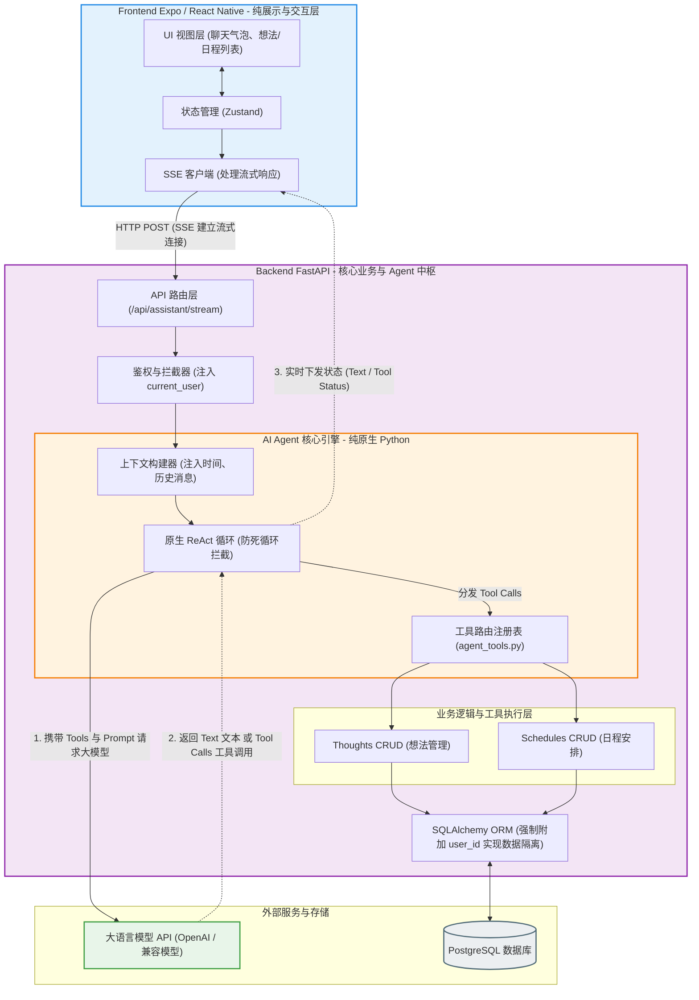

# 🚀 FastAIStack

<p align="center">
  
</p>

<p align="center">
  <b>基于 AI Agent 架构与前后端极致分离理念构建的多用户、轻量级 AI 助手平台。</b>
</p>

<p align="center">
  <a href="#-核心设计理念">核心设计理念</a> •
  <a href="#-技术栈">技术栈</a> •
  <a href="#-已完成功能">已完成功能</a> •
  <a href="#-快速启动">快速启动</a> •
  <a href="#-后续规划">后续规划</a>
</p>

---

## 🌟 核心设计理念

本项目致力于探索 AI 原生时代下的工程新范式：
- **前端仅作为“展示层与交互层”**，无核心业务逻辑。
- **所有的“思考”与“行动”全部下沉至后端大模型（Agent 中枢）承载。**

### 系统架构图



### 核心特性

1. **🧠 Agent 中枢路由模式**：摒弃传统的关键词或正则表达式做意图识别，引入 LLM 作为系统的“大脑（Router）”。
2. **🧩 多端支持与模块化单体**：前端使用 Expo 构建，一套代码同时适配 Web、iOS 和 Android；内部采用模块化解耦，可按需挂载或卸载独立功能模块（如“想法”、“日程”）。
3. **🛡️ 数据隔离与安全**：基于 PostgreSQL 实现多租户（多用户）数据安全隔离，配合 Token 机制提供无感刷新防数据丢失的极佳体验。

## 🛠️ 技术栈

| 模块 | 技术选型 | 核心职责 |
| --- | --- | --- |
| **Frontend (前端)** | [Expo](https://expo.dev/) (React Native) + Zustand | **零业务逻辑**。纯粹负责跨端 UI 渲染、状态管理、接口调用。 |
| **Backend (后端)** | [FastAPI](https://fastapi.tiangolo.com/) (Python) | **全业务逻辑**。提供 RESTful API，承载 Token 鉴权、Agent 中枢调度、各业务模块的 CRUD。 |
| **Database (数据库)** | PostgreSQL + SQLAlchemy + Alembic | 持久化存储用户、日程、想法等数据，从底层通过 `user_id` 保障多用户数据绝对隔离。 |
| **AI Layer (大模型)** | 兼容主流 LLM API (如通义、文心、OpenAI 等) | 担任系统意图拆解与内容生成的引擎，支持 Function Calling 工具调用。 |

## ✨ 已完成功能 (MVP)

- [x] **🔐 完善的用户系统**：支持用户注册、登录、退出，JWT 鉴权及 Token 失效的自动处理（401 全局拦截与状态管理）。
- [x] **🤖 智能 Agent 中枢**：
  - 支持多轮自然对话，拥有“高情商、博学”的通用人设。
  - **原生 ReAct 循环**：纯原生 Python 实现的大模型调度机制，摒弃繁重的第三方框架（如 LangChain），保持极致轻量。
  - **工具路由分发**：精准识别用户意图，按职责调度独立拆分的工具层模块，保持代码高内聚低耦合。
- [x] **💡 想法管理 (Thoughts)**：通过自然语言即可快速记录、查询、管理个人想法与灵感。
- [x] **📅 日程管理 (Schedules)**：一句话即可创建、管理日程计划，自动解析时间与星期。
- [x] **🌐 联网搜索能力**：集成 Tavily API，当模型需要实时信息或突破知识库限制时，自动触发联网搜索。

## 🚀 快速启动

### 1. 启动后端 (FastAPI)
后端采用 FastAPI 构建，确保你已经安装了 Python 环境及 PostgreSQL 数据库。
```bash
cd backend
# 建议使用虚拟环境：python -m venv venv && source venv/bin/activate
pip install -r requirements.txt

# 配置环境变量 (请复制 .env.example 并修改配置)
cp .env.example .env

# 执行数据库迁移
alembic upgrade head

# 启动服务
uvicorn main:app --host 0.0.0.0 --reload --port 8000
```
后端服务启动后，可以访问 `http://localhost:8000/docs` 查看自动生成的 API 接口文档。

### 2. 启动前端 (Expo)
前端采用 Expo (React Native) 框架，确保你已经安装了 Node.js 环境。
```bash
cd frontend
npm install

# 配置环境变量
cp .env.example .env

# 启动服务
npx expo start
```
- 按 `w` 在 Web 浏览器中打开
- 按 `a` 在 Android 模拟器中打开
- 按 `i` 在 iOS 模拟器中打开

## 🗺️ 后续规划 (Roadmap)

本项目将持续迭代，长期发展方向包括但不限于：

- [ ] **🧩 更多 Agent 工具插件**：如天气查询、邮件管理、文件解析（PDF/Excel）等。
- [ ] **🎨 复杂 UI 的跨端渲染优化**：对于复杂的数据图表或特殊展示页，计划采用 WebView 嵌入纯 Web H5 页面，提升多端一致性与开发效率。
- [ ] **🔄 容错与高可用**：为联网搜索及外部 API 调用增加重试机制和降级策略，保障 AI 助手的稳定性。
- [ ] **🐳 容器化部署优化**：完善 Docker 及 `docker-compose.yml` 配置，实现服务的一键编排与生产环境部署。
- [ ] **💬 多会话与历史记录持久化**：支持创建多个独立的对话记录页，并将所有聊天历史安全持久化至数据库，实现跨设备无缝回溯。
- [ ] **⚡ 灵活的交互控制**：提升用户交互的灵活性，支持在流式输出时随时打断 AI 回复，并优化用户连续提问时的等待处理与排队机制。

## 🤝 参与贡献

欢迎提交 Issue 和 Pull Request！在参与开发前，请先了解项目的极简架构设计与前后端极致分离的核心理念，欢迎一起探索并完善这个平台。

## 📄 许可与规范

本项目遵循 [MIT License](LICENSE)（假设）。请参考项目规范进行开发。
